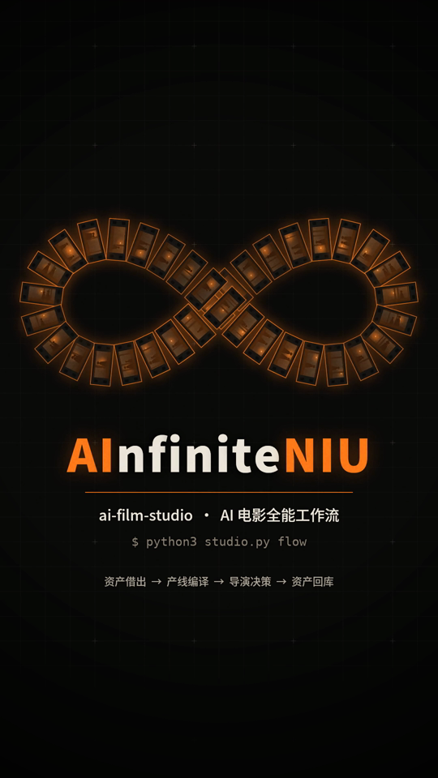
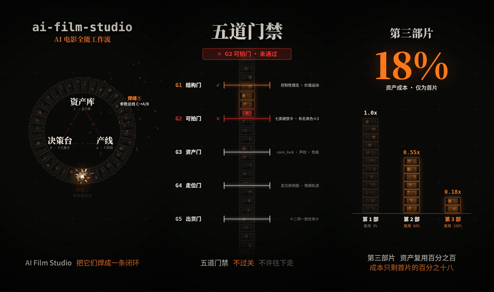

<p align="center">
  
</p>

<h1 align="center">ai-film-studio · AI 电影全能工作流</h1>

<p align="center">
  资产库借出 → 产线编译 → 决策台拍板 → 出片 → 资产回库 → 参数回流<br>
  <b>输入剧本，输出全片提示词包 + HTML 分镜表 + 成本报告 + 统一看板。<br>每一部片，都让下一部更快、更准、更便宜。</b>
</p>

<p align="center">
  <a href="assets/ai-film-studio-demo.mp4">▶ 观看 43 秒介绍短片</a> ·
  <a href="#快速上手">快速上手</a> ·
  <a href="#安装为-claude-skill">安装</a> ·
  <a href="SKILL.md">SKILL.md</a>
</p>

<p align="center"></p>

---

## 这是什么

一个 Claude Skill（附带可独立运行的 Python 工具链），把三套 AI 电影生产系统焊成一条闭环产线：

| 子系统 | 目录 | 负责 |
|---|---|---|
| **A · 产线** film-pipeline-orchestrator | `modules/orchestrator/` | 八阶段状态机（S0–S7）+ 五道门禁，剧本 → 全片提示词 |
| **B · 决策台** director-console | `modules/console/` | 十三类决策卡，穷举选项并标出成本与抽卡风险，由人来选 |
| **C · 资产库** studio-library | `modules/library/` | 演员 / 场景 / 道具 / 微节拍句库 / 失败档案，跨项目复用 |

## 三条焊缝

1. **参数总线**（`bus/sync.py`）——资产库里的实测数据单向流向产线和决策台。样本够了，「拍脑袋」的风险系数自动换成实测值。
2. **微表演接合**（`bus/enrich.py`）——产线留空的【微表演】，由句库和导演决策共同填上；类型不匹配的句子绝不跨用。
3. **单一 `project.json`**——三套系统读写同一份状态，没有导入导出，没有格式转换。

## 五道门禁

| 门禁 | 拦什么 |
|---|---|
| G1 结构门 | 控制性理念、每场价值运动、片长容差、极性不平 |
| G2 可拍门 | 七类 AI 硬禁令、有名角色 ≤3（剧本层是全链路最便宜的拦截点） |
| G3 资产门 | 角色 core_lock 与声纹、场景多视图、道具规格、色板锁定 |
| G4 走位门 | 多人场次走位图、情绪轨迹 |
| G5 出货门 | 跨提示词一致性审计（句柄漂移、服装断裂、焦距/光源教条等） |

> 门禁只判定，不修改。不过关就修问题，不是改阈值。

## 实测（`examples/` 可完整复现）

```
 # 项目          资产  复用   复用率   资产成本   vs首片
 1 xingming       4    0      0%      59.2     1.0x
 2 xingming2      5    3     60%      32.8    0.55x
 3 xingming3      4    4    100%      10.4    0.18x
```

## 快速上手

纯 Python 3 标准库，无第三方依赖（已在 Python 3.12 上测试）。

```bash
git clone https://github.com/hdyyinfiniteai-jpg/ai-film-studio.git
cd ai-film-studio/examples
python3 ../tools/studio.py --file project.json compile
python3 ../tools/studio.py --file project.json --deck deck.json decide
python3 ../tools/studio.py --file project.json --deck deck.json --genre 古装 build
python3 ../tools/studio.py --file project.json --out out ship
python3 ../tools/studio.py --file project.json close
python3 ../tools/studio.py --file project.json --deck deck.json board
```

`ship` 之后在 `examples/out/` 下得到 `Shotlist.html`（分镜表）、`prompts/`（提示词包）、`cost_report.json`（成本报告）。
示例是《刑名·终》三场，已跑通全流程。更多细节见 [QUICKSTART.md](QUICKSTART.md)。

### 开新片

```bash
python3 tools/studio.py new --id p4 --title "《新片》" \
    --aesthetic cold-court-noir --persona PV-0142 --location LV-0001 \
    --idea "一句话控制性理念" --runtime 60
# 往 project.json 填 scenes[]，然后：
python3 tools/studio.py flow
```

## 安装为 Claude Skill

**Claude Code：**

```bash
git clone https://github.com/hdyyinfiniteai-jpg/ai-film-studio.git ~/.claude/skills/ai-film-studio
```

**Claude 应用：** 下载本仓库 zip，在 Claude 的技能（Skills）设置中上传。

装好后直接说「帮我做一部 AI 片」「从剧本开始一路做到成片提示词」「这部片要花多少」即可触发。

## 目录

```
SKILL.md                技能入口（Claude 读取）
QUICKSTART.md           快速上手
tools/studio.py         统一 CLI
tools/dashboard.py      统一看板
bus/                    参数总线 + 微表演接合
modules/orchestrator/   A · 产线
modules/console/        B · 决策台
modules/library/        C · 资产库（含种子数据）
examples/               可复现示例
reference/seams.md      三条焊缝说明
assets/                 介绍短片与预览图
```

## 已知限制

- 决策卡组是快照：`sync` 之后需重跑 `decide`。
- 样本不足时一律标注为估计：E[尝试次数] 需 ≥20 条通过样本，风险系数需 n≥15。
- 微表演种子句库 51 条，古装 8、喜剧 6，其余类型更薄；`vault.py health` 会报缺口。

## 作者

**DoubleNiu · AInfiniteNIU**

## 许可

[MIT](LICENSE)
